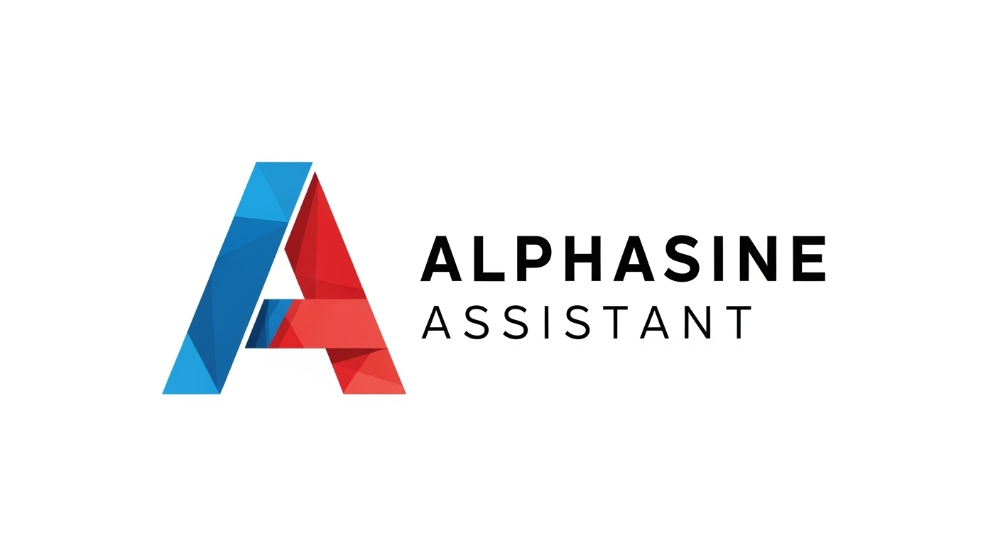

<h1 align="center">
  <a href="https://github.com/alphasine/AlphasineAssistant">
    
  </a>
</h1>

<div align="center">

[](https://github.com/alphasine/AlphasineAssistant)
[](https://x.com/alphasine_ai)
[](https://deepwiki.com/alphasine/AlphasineAssistant)

</div>

<div align="center">
  <br>
  <p>
    <strong>AlphasineAssistant</strong> is a free, open-source AI web automation tool that runs as a Chrome extension.
    <br>
    It provides a powerful multi-agent system, flexible LLM options, and a commitment to privacy.
  </p>
  <p>
    <a href="https://x.com/alphasine_ai">Follow us on X</a>
  </p>
</div>

<div align="center">
  
  <p>
    <em>AlphasineAssistant's multi-agent system analyzing HuggingFace in real-time, with the Planner intelligently self-correcting when encountering obstacles and dynamically instructing the Navigator to adjust its approach—all running locally in your browser.</em>
  </p>
</div>

## 🔥 Why AlphasineAssistant?

**AlphasineAssistant** is a Chrome extension that offers premium web automation capabilities while ensuring you remain in complete control. It is a powerful AI web agent without the high costs of alternatives like OpenAI Operator.

- **100% Free & Open Source**: No subscription fees or hidden costs. Use your own API keys and only pay for what you use.
- **Privacy-Focused**: Everything runs locally in your browser. Your credentials and data are never shared with any cloud service.
- **Flexible LLM Options**: Connect to your preferred LLM providers and choose different models for different agents.

> **Note**: We currently support OpenAI, Anthropic, Gemini, Ollama, Groq, Cerebras, and custom OpenAI-compatible providers, with more to come.

## 📊 Key Features

- **Multi-Agent System**: Specialized AI agents collaborate to accomplish complex web workflows.
- **Interactive Side Panel**: An intuitive chat interface with real-time status updates.
- **Task Automation**: Seamlessly automate repetitive tasks across various websites.
- **Follow-up Questions**: Ask contextual follow-up questions about completed tasks.
- **Conversation History**: Easily access and manage your interaction history with the AI agents.
- **Multiple LLM Support**: Connect your preferred LLM providers and assign different models to different agents.

## 🌐 Browser Support

| Browser | Support Level      |
| :------ | :----------------- |
| Chrome  | ✅ Full Support    |
| Edge    | ✅ Full Support    |
| Others  | ❌ Not Supported |

> While AlphasineAssistant may function on other Chromium-based browsers (e.g., Opera, Arc), we recommend using Chrome or Edge for the best experience.

## 🚀 Quick Start

1.  **Install from Chrome Web Store**:
    - Visit the [AlphasineAssistant Chrome Web Store page](https://chromewebstore.google.com/detail/AlphasineAssistant/imbddededgmcgfhfpcjmijokokekbkal).
    - Click "Add to Chrome" and confirm the installation.

2.  **Configure Agent Models**:
    - Open the AlphasineAssistant sidebar and click the `Settings` icon.
    - Add your LLM API keys and choose the models for the Navigator, Planner, and Validator agents.

> For the latest features, we recommend a manual installation, as the Chrome Web Store version may have review delays.

## 🔧 Manual Installation

To get the most recent version, follow these steps:

1.  **Download**:
    - Get the latest `AlphasineAssistant.zip` from the [releases page](https://github.com/alphasine/AlphasineAssistant/releases).

2.  **Install**:
    - Unzip the file.
    - Open `chrome://extensions/` in Chrome, enable `Developer mode`, and click `Load unpacked`.
    - Select the unzipped `AlphasineAssistant` folder.

3.  **Configure**:
    - Follow the configuration steps from the Quick Start section.

4.  **Upgrade**:
    - Replace your existing `AlphasineAssistant` files with the new ones from the latest release.
    - Refresh the extension on the `chrome://extensions/` page.

## 🛠️ Build from Source

1.  **Prerequisites**:
    - [Node.js](https://nodejs.org/) (v22.12.0 or higher)
    - [pnpm](https://pnpm.io/installation) (v9.15.1 or higher)

2.  **Clone the Repository**:
    ```bash
    git clone https://github.com/alphasine/AlphasineAssistant.git
    cd AlphasineAssistant
    ```

3.  **Install Dependencies**:
    ```bash
    pnpm install
    ```

4.  **Build the Extension**:
    ```bash
    pnpm build
    ```

5.  **Load the Extension**:
    - The built extension will be in the `dist` directory.
    - Follow the manual installation steps to load the extension.

6.  **Development Mode** (optional):
    ```bash
    pnpm dev
    ```

## 🤖 Model Recommendations

AlphasineAssistant allows you to configure different LLMs for each agent to balance performance and cost.

| Configuration         | Planner & Validator         | Navigator                  | Notes                                            |
| :-------------------- | :-------------------------- | :------------------------- | :----------------------------------------------- |
| **Better Performance**| Claude 3.7 Sonnet           | Claude 3.5 Haiku           | Better reasoning and reliable task validation.   |
| **Cost-Effective**    | Claude Haiku or GPT-4o      | Gemini 2.0 Flash or GPT-4o-mini | May require more iterations for complex tasks.   |
| **Local Models**      | Qwen3 14B, Falcon3 10B, etc.| Qwen3 14B, Falcon3 10B, etc.| Requires specific and clean prompts.             |

> **Note**: For local models, use Ollama or other custom OpenAI-compatible providers.

## 💡 Examples

Here are some tasks you can accomplish with a single sentence:

1.  **News Summary**:
    > "Go to TechCrunch and extract the top 10 headlines from the last 24 hours."

2.  **GitHub Research**:
    > "Find the trending Python repositories on GitHub with the most stars."

3.  **Shopping Research**:
    > "Find a portable Bluetooth speaker on Amazon with a water-resistant design, under $50, and a battery life of at least 10 hours."

## 🛠️ Roadmap

We are actively developing AlphasineAssistant. Check out our [roadmap](https://github.com/alphasine/AlphasineAssistant/discussions/85) for upcoming features.

## 🤝 Contributing

We welcome contributions of all kinds! Please see our [CONTRIBUTING.md](CONTRIBUTING.md) for guidelines.

- **Provide feedback** on performance or suggest improvements.
- **Contribute code** by submitting a pull request.

## 🔒 Security

If you discover a security vulnerability, please create a [GitHub Security Advisory](https://github.com/alphasine/AlphasineAssistant/security/advisories/new).

## 💬 Community

- [Twitter](https://x.com/alphasine_ai): Follow for updates.
- [GitHub Discussions](https://github.com/alphasine/AlphasineAssistant/discussions): Share ideas and ask questions.

## 👏 Acknowledgments

AlphasineAssistant is built on these open-source projects:

- [Browser Use](https://github.com/browser-use/browser-use)
- [Puppeteer](https://github.com/EmergenceAI/Agent-E)
- [Chrome Extension Boilerplate](https://github.com/Jonghakseo/chrome-extension-boilerplate-react-vite)
- [LangChain](https://github.com/langchain-ai/langchainjs)

## 📄 License

This project is licensed under the Apache License 2.0. See the [LICENSE](LICENSE) file for details.


